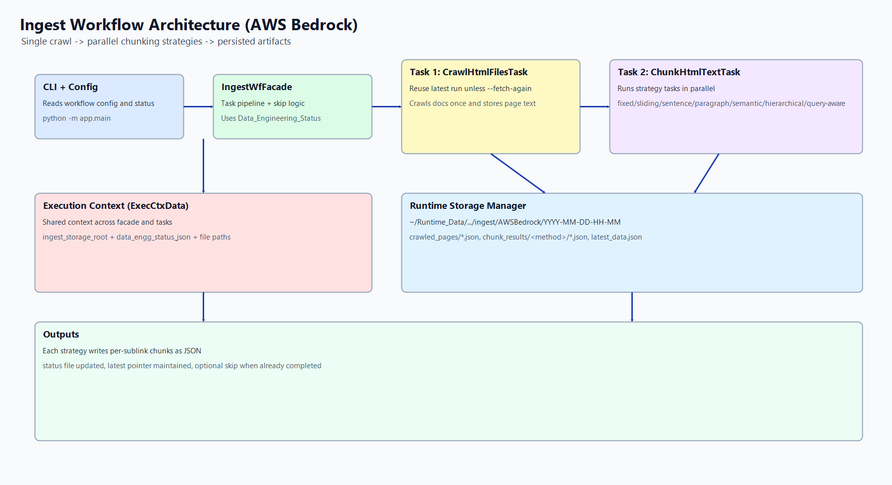

# InfoHub-Chatbot-LangChain

This project uses `uv` for Python dependency management and `npm` scripts as convenient local command wrappers.

## Prerequisites

- Python 3.11
- `uv` installed on your machine
- Node.js + npm
- Bash-compatible shell (Git Bash, WSL, or similar)

Install `uv` on Windows:

```powershell
winget install --id astral-sh.uv -e --accept-package-agreements --accept-source-agreements
```

## Local setup commands

Initialize local setup (creates/uses venv, syncs dependencies, prints status):

```bash
npm run setup:local:init
```

Set up only the venv:

```bash
npm run setup:local:venv:setup
```

Show the activate command for your current shell:

```bash
npm run setup:local:venv:activate
```

Show the deactivate guidance:

```bash
npm run setup:local:venv:deactivate
```

Show environment status:

```bash
npm run setup:local:status
```

Destroy environment:

```bash
npm run setup:local:destroy
```

Other useful commands:

```bash
npm run setup:local:sync
npm run setup:local:python:version
npm run setup:local:deps:check
```

## Ingest workflow CLI



The CLI now reads workflow settings from `app/config.json`, so you do not need to pass crawl arguments each run.

Workflow task order is externalized in `app/workflows/workflow_tasks.json`.
Each parent workflow can define a default task list and optional child-specific overrides in `module.path:ClassName` format.

Run with the default workflow from config:

```bash
uv run --active python -m app.main
```

Optional JSON output for scripting:

```bash
uv run --active python -m app.main --json
```

Force a fresh crawl into a new timestamp folder:

```bash
uv run --active python -m app.main --fetch-again --json
```

Run a specific workflow entry from config:

```bash
uv run --active python -m app.main --workflow ingest
uv run --active python -m app.main --workflow AWSBedrock
uv run --active python -m app.main --workflow ingest/AWSBedrock
```

`AWSBedrock` is the default child under the `ingest` parent workflow.

Use a different config file:

```bash
uv run --active python -m app.main --config ./app/config.json
```

Supported flags:

- `--config`
- `--workflow`
- `--json`
- `--fetch-again`

Config format is modularized by workflows:

```json
{
  "default_workflow": {
    "parent": "ingest",
    "child": "AWSBedrock"
  },
  "workflows": {
	"ingest": {
	  "default_child": "AWSBedrock",
	  "children": {
		"AWSBedrock": {
		  "workflow_id": "ingest_001",
		  "seed_url": "https://docs.aws.amazon.com/bedrock/latest/userguide/what-is-bedrock.html",
		  "allowed_domains": ["docs.aws.amazon.com"],
		  "allowed_path_prefixes": ["/bedrock/latest/userguide/"],
		  "max_tokens": 400,
		  "overlap_tokens": 40,
		  "max_pages": 30,
		  "max_depth": 2,
		  "timeout_seconds": 20,
		  "chunking_methods": [
			"fixed_token",
			"sliding_window_overlap",
			"sentence",
			"paragraph_section",
			"semantic",
			"hierarchical",
			"query_aware"
		  ],
		  "query_terms": ["knowledge base", "foundation model", "guardrails"]
		}
	  }
	}
  }
}
```

If no workflow is provided, the default is `ingest/AWSBedrock`.

Each child workflow must define a stable `workflow_id`. Example: `ingest_001`.
The selector name is for humans; the ID is for runtime storage and status tracking.

`ingest` is now a parent workflow: crawl once, then apply all configured chunking methods in parallel on the already-crawled text.

Task responsibilities:

- `IngestWfFacade`: orchestrates task order and status-based skip behavior.
- `CrawlHtmlFilesTask`: single crawl and readable-text extraction per page.
- `ChunkHtmlTextTask`: parallel strategy execution on already-crawled text.
- `IngestStorageManager`: writes crawl/chunk artifacts and `latest_data.json`.

Detailed strategy/task documentation: `README_INGEST_CHUNKING.md`.

Task registry example:

```json
{
  "ingest": {
	"default": [
	  "app.workflows.data_load.tasks.extract_html_files:CrawlHtmlFilesTask",
	  "app.workflows.data_load.tasks.chunking.parallel_chunking_task:ChunkHtmlTextTask"
	],
	"children": {
	  "AWSBedrock": [
		"app.workflows.data_load.tasks.extract_html_files:CrawlHtmlFilesTask",
		"app.workflows.data_load.tasks.chunking.parallel_chunking_task:ChunkHtmlTextTask"
	  ]
	}
  }
}
```

Runtime output is stored under:

- `~/Runtime_Data/AI_Projects/InfoHub-Chatblot/ingest/ingest_001/YYYY-MM-DD-HH-MM/...`
- `latest_data.json` in `ingest_001` points to the latest timestamp folder.
- Without `--fetch-again`, the latest folder is reused when available.
- With `--fetch-again`, a new timestamp folder is created and `latest_data.json` is updated.

Workflow completion state is tracked in:

- `~/Runtime_Data/AI_Projects/InfoHub-Chatblot/Data_Engineering_Status.json`

That status file uses `workflow_id` keys such as `ingest_001`.

This generated status file is gitignored. Template file: `app/data_engineering_status.template.json`.

Note: `npm run` executes in a child process, so activate/deactivate cannot directly mutate your current terminal session. Use the printed activation command in the shell you want to work in.

## Optional: choose a custom venv location

By default, scripts use:

1. `INFOHUB_VENV_PATH` (if set)
2. `VIRTUAL_ENV` (if set)
3. Project-local `.venv`

Example (Bash):

```bash
export INFOHUB_VENV_PATH="$HOME/runtime_data/python_venvs/InfoHub-Chatbot-LangChain"
npm run setup:local:init
```

## PyCharm interpreter

Set the project interpreter to `<venv-path>/Scripts/python.exe` (Windows venv) or `<venv-path>/bin/python` (Unix venv), based on your resolved environment path.

Current direct dependencies are tracked in `pyproject.toml`:

- `openai`
- `beautifulsoup4`
- `pandas`
- `scipy`
- `tiktoken`
