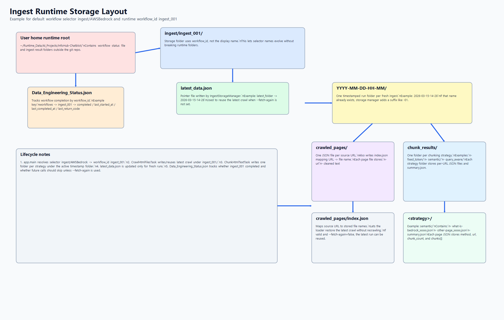

# Ingest Chunking Guide

## Ingest task map

Default workflow selection is `ingest/AWSBedrock` when no workflow is provided.
Its stable runtime ID is `ingest_001`, which is used for storage folders and workflow status tracking.

- `IngestWfFacade`: orchestrates task order, checks workflow status, and skips completed runs unless fetch is forced.
- `workflow_tasks.json`: external registry that maps a workflow name to the task list to execute.
- `CrawlHtmlFilesTask`: crawls Bedrock docs once, extracts readable text, and decides whether to reuse latest data or fetch again.
- `ChunkHtmlTextTask`: runs chunking strategy tasks in parallel after crawl text is ready.
- `IngestStorageManager`: persists crawled pages, per-strategy chunk outputs, and latest run pointer.
- `ExecCtxData`: shares runtime context between facade and tasks (storage root, status json, paths).
- `ExtractHtmlFilesTask`: compatibility wrapper that executes crawl then chunk tasks.

## What this project does

- Starts from a seed documentation page.
- Crawls related links from the same documentation area.
- Extracts readable text from each page. This means the human-visible words people read (titles, headings, paragraphs, bullets, and table text), while ignoring markup and page code.
- How we decide it is readable: if a page returns normal language text after cleanup (not just scripts, styling, or empty structure), it is used for chunking; otherwise it is skipped.
- Splits text into token-sized chunks.

## One simple example

Input example used below:

> "Model customization is the process of providing training data to a model in order to improve its performance for specific use-cases. You can customize Amazon Bedrock foundation models in order to improve their performance and create a better customer experience. Amazon Bedrock currently provides the following customization methods.
>
> Supervised fine-tuning
>
> Provide labeled data in order to train a model to improve performance on specific tasks. By providing a training dataset of labeled examples, the model learns to associate what types of outputs should be generated for certain types of inputs. The model parameters are adjusted in the process and the model's performance is improved for the tasks represented by the training dataset.
>
> For more information about using supervised fine-tuning, see Customize a model with fine-tuning in Amazon Bedrock.
>
> Reinforcement fine-tuning
>
> Reinforcement fine-tuning improves foundation model alignment with your specific use case through feedback-based learning. Instead of providing labeled input-output pairs, you define reward functions that evaluate response quality. The model learns iteratively by receiving feedback scores from these reward functions.
>
> You can upload your training prompt datasets or provide existing Bedrock invocation logs. You can define reward functions using AWS Lambda to evaluate response quality. Amazon Bedrock automates the training workflow and provides real-time metrics to monitor model learning progress.
>
> For more information about using reinforcement fine-tuning, see Customize a model with reinforcement fine-tuning in Amazon Bedrock.
>
> Distillation
>
> Use distillation to transfer knowledge from a larger more intelligent model (known as teacher) to a smaller, faster, and cost-efficient model (known as student). Amazon Bedrock automates the distillation process by using the latest data synthesis techniques to generate diverse, high-quality responses from the teacher model, and fine-tunes the student model.
>
> To use distillation, you select a teacher model whose accuracy you want to achieve for your use case, and a student model to fine-tune. Then, you provide use case-specific prompts as input data. Amazon Bedrock generates responses from the teacher model for the given prompts, and then uses the responses to fine-tune the student model. You can optionally provide labeled input data as prompt-response pairs.
>
> For more information about using distillation see Customize a model with distillation in Amazon Bedrock.
>
> For information about model customization quotas, see Amazon Bedrock endpoints and quotas in the AWS General Reference."

How to read that input:

- intro = what model customization means
- section 1 = "Supervised fine-tuning"
- section 2 = "Reinforcement fine-tuning"
- section 3 = "Distillation"

## How chunking is done here

- Text is split word-by-word.
- A chunk grows until adding one more word would pass the token limit.
- When the limit is reached, a new chunk starts.
- Each page produces multiple chunks, all kept in original reading order.
- The crawl stage is done once; all chunking strategies reuse the same extracted page text.

## Why this approach

- Keeps each chunk small enough for LLM context windows.
- Improves retrieval precision compared to sending whole pages.
- Reduces prompt cost and latency.
- Preserves flow better than random fixed character cuts.

## Practical tradeoffs

- Very simple and reliable.
- Fast to run at scale.
- Can break context at arbitrary sentence boundaries.
- No overlap means edge facts near boundaries can be harder to retrieve. In simple terms, when one idea ends at the bottom of one chunk and continues in the next chunk, a search may fetch only one side and miss the full meaning.

## Common industry chunking strategies

- **Fixed-size token chunking**: simple blocks by token count; fast baseline.
- **Sliding window with overlap**: repeated context across chunks; better recall near boundaries.
- **Sentence-based chunking**: splits on sentence endings; more natural semantics.
- **Paragraph/section chunking**: aligns with headings and document structure.
- **Semantic chunking**: uses embeddings or similarity shifts to split where topic changes.
- **Hierarchical chunking**: large parent chunks + smaller child chunks for multi-stage retrieval.
- **Query-aware chunking**: creates chunks dynamically based on user intent or domain rules.

## Strategy tasks implemented

- `fixed_token`: follows token size only. Output might look like `"Model customization is the process... Supervised fine-tuning..."` and then the next chunk starts with `"Provide labeled data..."` even if a topic boundary is cut awkwardly.
- `sliding_window_overlap`: similar to fixed token, but repeats some tail text. Output might look like `"...Supervised fine-tuning... Provide labeled data..."` and the next chunk again starts with `"Provide labeled data..."` before moving on.
- `sentence`: tries to keep sentences whole. Output might keep `"Reinforcement fine-tuning improves foundation model alignment..."` as one natural unit before combining it with nearby sentences.
- `paragraph_section`: respects section/paragraph boundaries more strongly. Output might become `"Supervised fine-tuning ..."`, then `"Reinforcement fine-tuning ..."`, then `"Distillation ..."` as separate chunks.
- `semantic`: tries to split when the topic changes. Output might separate `"what model customization means"`, `"Supervised fine-tuning"`, `"Reinforcement fine-tuning"`, and `"Distillation"` into different chunks.
- `hierarchical`: first makes broader groups, then smaller ones. Output might first group `"intro + Supervised fine-tuning"` broadly, then create smaller child chunks under that parent.
- `query_aware`: emphasizes text related to query terms. If the query is `"distillation"`, output may focus on `"Distillation"`, `"teacher"`, `"student"`, and the nearby explanation paragraphs first.

Aliases accepted in config:

- `fixed_token_overlap` -> `sliding_window_overlap`
- `paragraph` -> `paragraph_section`

## Strategy quick view

| Strategy | Quality | Speed | Cost | Best for |
|---|---|---|---|---|
| Fixed-size token | Medium | Very High | Low | Fast MVP and baseline RAG |
| Sliding window overlap | Medium-High | High | Medium | Better recall near chunk boundaries |
| Sentence-based | High | High | Medium | Q&A over prose-heavy docs |
| Paragraph/section | High | Medium-High | Medium | Technical docs with clear structure |
| Semantic | High | Medium | Medium-High | Topic-dense mixed-content documents |
| Hierarchical | Very High | Medium | High | Large enterprise knowledge bases |
| Query-aware | Very High | Medium-Low | High | Specialized domains and adaptive retrieval |

## Practical default

- Start with fixed-size token chunks.
- Add 10-20% overlap if retrieval misses boundary facts. This repeats a small part of the previous chunk in the next chunk so connected sentences stay visible together during retrieval.
- Move to section-aware or semantic chunking when answer quality plateaus. Plateau means answers stop getting better even after basic tuning, so smarter splitting based on document structure or meaning is needed.

## When to use which

- Start with fixed token chunking for speed and simplicity.
- Add overlap when factual continuity is important. Use this when one fact depends on the sentence before or after it, such as steps, warnings, limitations, or comparisons.
- Use structure-aware or semantic chunking for long technical docs.
- Use hierarchical chunking for enterprise-scale corpora and complex QA.

## Recommended next evolution

- Add small overlap (for example 10-20%) to improve boundary recall. Boundary recall means finding facts that sit near chunk edges, which are the easiest details to lose without overlap.
- Keep headings with nearby text to preserve context.
- Track retrieval metrics (precision, recall, answer quality) before and after changes.

